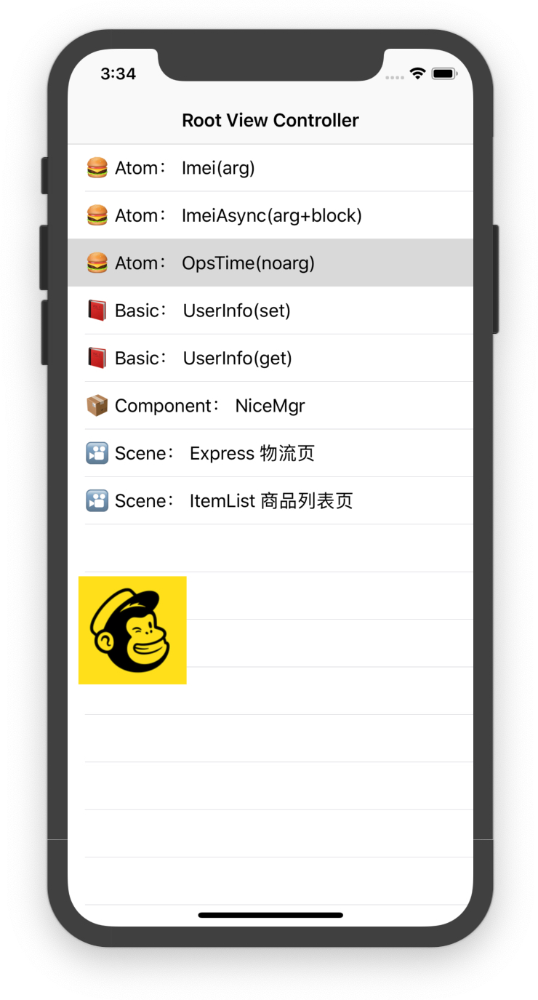

# IOSGateway
```text
在 https://github.com/Q14/QJRouter 基础上增加了若干功能，实现不同逻辑的分层和路由。
基于runtime和约定进行了修改。
按atom、basic、component、scene进行了分层
```



## Feature
- 🎉 按约定对atom、basic、component、scene进行了分层
- 🎉 基于官方Runtime，无hack语法
- 🎉 基于url schema约定/${layer}/${Class}/${Method}来实现业务调用
- 🎉 增加了对block的支持
- 🎉 增加了对invocation的支持
- 🎉 增加了对multi withObject的支持
- 🎉 收敛网关，暴露相关api，以便支持审计、限流、打点等能力


## Version 1.2.0
